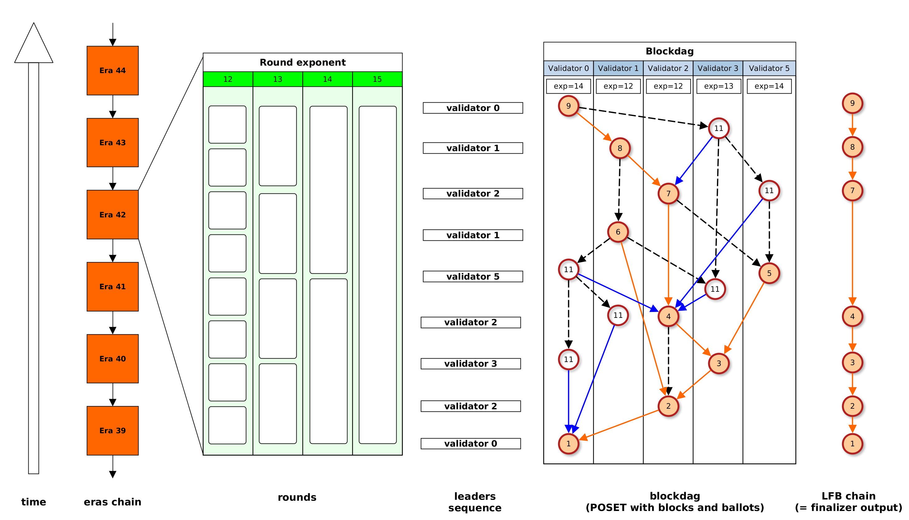

Highway overview
================

Introduction
------------

Blockchain is a P2P network where nodes (**validators**) concurrently update a decentralized, shared database. They do
this by collectively building an ever-growing chain of read/write **transactions**.

Alternatively, the blockchain can be seen as a computer. This blockchain computer has memory (= shared database)
and can execute programs (= transactions). Execution of a program changes the state of the memory. Anybody can send
a program to the computer and the computer will do a best effort attempt to execute this program.

We say that a blockchain computer is **decentralized**, i.e. there is no single point of failure in the infrastructure.
A significant portion of the network of validators could be suddenly destroyed and nevertheless the blockchain will
continue to work. Also, the system is resistant to malicious validators (as long as the total weight of malicious
validators is below certain threshold - this is explained later).

The core of blockchain mechanics is the continuous work of validators struggling to agree on a consistent history of
programs executed on the blockchain computer. We describe this central idea as “achieving **consensus** on the chain
of transactions”.

For performance reasons transactions are bundled in **blocks** and the so the resolution of consensus is also at blocks
level.

Solution in a nutshell (for a reader with blockchain background)
----------------------------------------------------------------

The essence of the solution is described in his section. This is for an advanced reader that would like to get the big
picture before reading the whole theory. All concepts referenced here and introduced again and explained later in
this document.

Network
~~~~~~~

Validators broadcast blocks and ballots. A block contains a sequence of transactions, while a ballot is only for
voting. We assume exactly-once delivery and delivery delays with common upper bound (= partial synchrony).
Validators use synchronized clocks.

Messages DAG
~~~~~~~~~~~~

Messages (blocks and ballots) cite each other, which leads to a POSET structure. The cited messages are called
"justifications". Also, blocks form a tree by every block pointing to its parent, and every ballots points to its
"target block". "Swimlane" is the set of messages created by a single validator.

Leaders sequence and rounds
~~~~~~~~~~~~~~~~~~~~~~~~~~~

Validators produce messages following a pseudo-random leaders sequence. Round length is :math:`2^k` milliseconds,
where :math:`k` is the "round exponent" and is picked individually by each validator. We enforce certain scheme
of messages production, which leads to every validator producing exactly 2 messages in a round. Validators can
auto-adjust round exponents they use - so to optimize the operation for the performance of network connection
and their local hardware.

Eras
~~~~

This is a proof-of-stake blockchain, where stakes are handled by a dedicated smart contract. Stake of a validator
equals to the number of tokens deposited on the associated account. Voting power of a validator is proportional to
its stake.

An era is a period of time for which the set of validators and their stakes is fixed.

Fork choice
~~~~~~~~~~~

This protocol uses the "Casper" principles: upon the creation of a block, its parent block it fully determined by the
set of justifications used. So there is no "freedom" in voting, rather it is the protocol which enforces what to vote
for.

Finality
~~~~~~~~

We iteratively apply Abstract Casper Consensus to pick a path in the blocks tree. This path is the chain of "finalized
blocks". I defines the outcome of the blockchain, i.e. the agreed chain of transactions that were executed on the
blockchain computer.

Safety and liveness
~~~~~~~~~~~~~~~~~~~

We developed mathematical proofs that our protocol is:

- safe (every validator will come up with the same finalized block chain)
- live (finalized blocks chain will keep growing, unless the total weight of malicious validators is below the
  fault tolerance threshold)

Motivation behind elements of the solution
------------------------------------------

**Blocks**
  With block, transactions are bundled together, so that the protocol overhead per transaction is lower.

**Parent block**
  Each block points to its parent, which leads to a tree of blocks (the root of the tree being Genesis block).
  This is the same trick as for example Bitcoin does. Ultimately only one path in this tree will be the "official"
  history of transactions, but the fact we have a tree allows for speed up - a validator can propose a new block,
  not waiting for previous block to be finalized. This introduces the risk of orphaning a block, but in return
  we get more more concurrency.

**Ballots**
  In proof-of-work ballots are not needed because it is just enough to say that "longest chain of blocks wins".
  Here in proof-of-stake the same trick does not work - it is just super cheap to create chains of blocks of arbitrary
  height. Therefore some other mechanism is needed for "finalizing" blocks, so ensuring certain path of history is
  agreed and cannot be reverted. In our solution this is based on voting and ballots are messages for transporting
  votes.

**Justifications**
  They realize the idea of "distributed time", i.e. the causal structure on top of the set of messages exchanged
  in the P2P protocol.

**Fork choice**
  Voting is enforced by the causal structure - the justifications "past cone" of a message enforces what history
  the validator must vote for (in this message). This rule is the basis on top of which the algebraic finality
  is built (as was already exposed in "Abstract Casper consensus" chapter).

**Leader sequence**
  In Bitcoin, every validator can propose a block a any time. The same level of freedom could be applied in our
  protocol, but this leads to difficulties in proving the liveness theorem. Hence we designed a more structured
  approach, when only the leader of current round (picked by a pseudo-random sequence) is allowed to propose a block,
  while other validators produce ballots. This makes the structure of the justifications DAG more predictable
  and becomes the main line of proving liveness.

**Round exponents**
  In every solution with leaders there is a problem of speed difference: such a solution works well only if the
  network is homogenous in terms of nodes and network performance. We mitigate this problem by allowing every validator
  to pick its own speed and adjust it later if needed - this is happening by selecting the length of rounds.
  We make a trick here - cooperation of validators using different round length is possible because we make
  everyone to use only powers of 2 as round lengths.

**Eras**
  Eras are needed for validators rotation and stake adjustment. Within an era the set of validators, their stakes and
  also the leaders pseudo-random sequence are all fixed. The definition of an era is build several eras ahead,
  in a special block called "the key block".

**Finalizer**
  Finalizer is the component that continuously picks the chain of blocks from blocks tree, which is the ultimate
  output of blockchain consensus. We consider finalizer as a separate component because the flexibility of
  Abstract Casper Consensus allows for different finalizers to be independently in use on top of the same blockchain.

